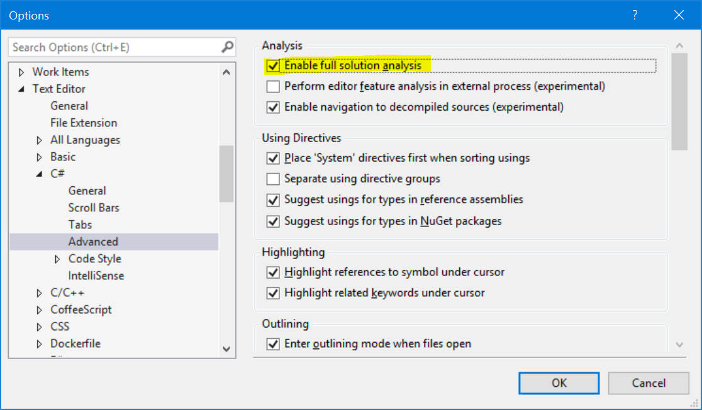

# Full Solution Analysis

Analyzers that require Full Solution Analysis produce diagnostics that may not always be visible in Visual Studio.

Diagnostics reported by such an analyzer will appear in a full build log. They may also appear in Visual Studio's Error List after a full build. But these diagnostics may disappear when the document they refer to is opened in the editor.

To ensure the diagnostics are always visible, even when documents are open, select the "Enable full Solution Analysis" option, as shown below:

